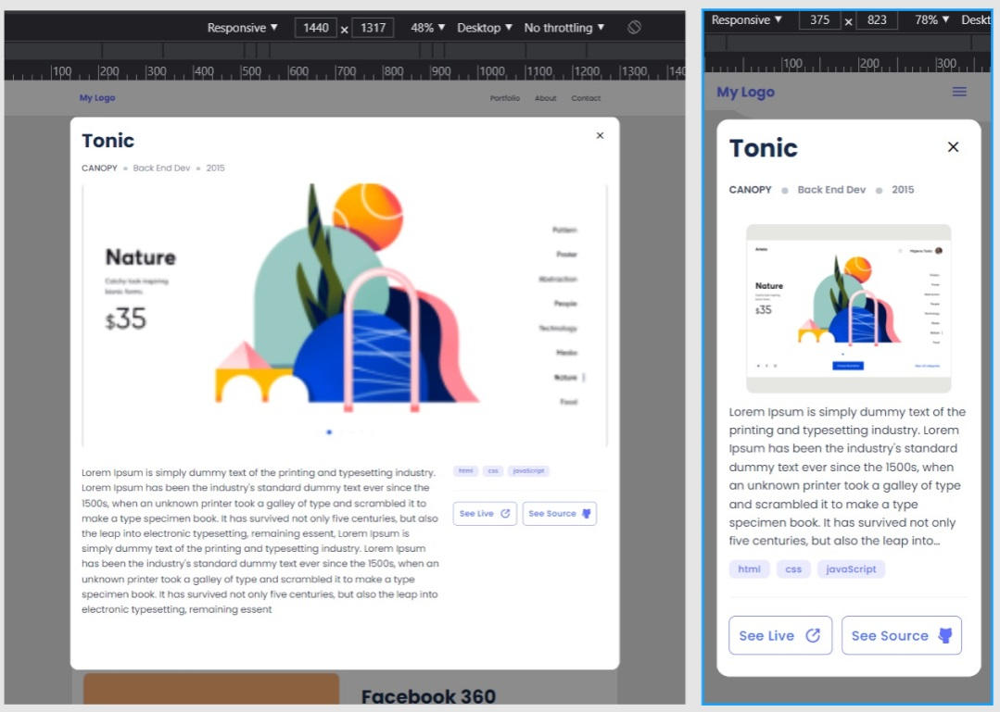

# Portfolio

> Microverse Assigment: Copy of a Portfolio design from Figma Template (Template 1)

## Live Demo

[Live Demo Link]()

## Built With

- HTML
- CSS (using Flex, Grid)
- JS

## Getting Started

**To clone this project**
**Run command: $git clone https://github.com/tmampa/portfolio-v1.git**
**or press the green Code button in the upper right corner and choose to download from the Download ZIP link.**

### Prerequisites

- Code editor (VS Code, Sublime, Atom)

## Author

- GitHub: [@tmampa](https://github.com/tmampa)
- Twitter: [@Tshephang_](https://twitter.com/tshephangm_)
- LinkedIn: [@Tshephang Mampa](https://linkedin.com/tshephangmampa)

## Show your support

Give a ⭐️ if you like this project!

## 📝 License

This project is [MIT](./MIT.md) licensed.
